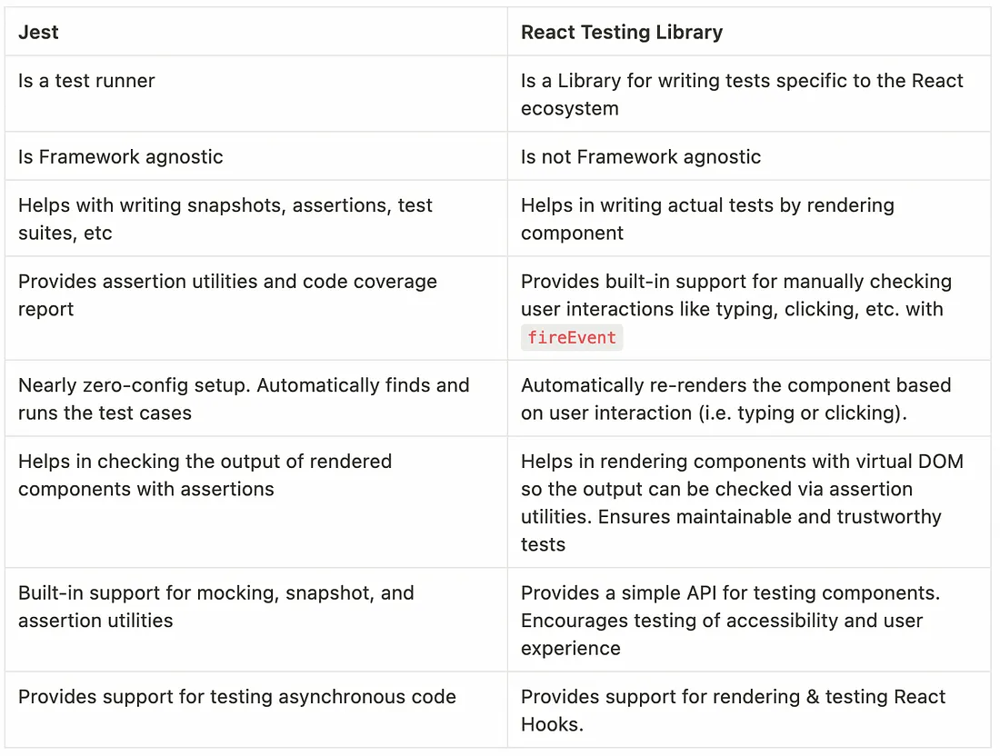

## Testing in React App

1. Types of Automated Tests
* Unit Tests
* Integration Tests
* E2E (end to end) Tests

2. Jest Vs RTL

Jest comes with a wide range of testing and assertion utilities that help developers test functionalities easily.

 React Testing Library is specifically tailored to test components in the React ecosystem

While Jest is a Test Runner and React Testing Library is specific to react ecosystem.



3. Anatomy of a test
4. Writing you first Test 
5. TDD (Test Driven Development)
6. Jest Watch Mode
7. Filtering Tests
    * filtering with file name and test name
    * .only and .skip
8. Grouping Tests
    * describe('name',test fns)
    * can be nested
    * has .only and .skip
9. File naming conventions
    - Files with .test.js or .test.tsx suffix
    - Files with .spec.js or .spec.tsx suffix
    - Files with .js or tsx suffix in __tests __ folder

jest not only has` test() `method but also `it()`, which inturn has `fit()` for `test.only()` and `xit()` for`test.skip()`

10. Code Coverage
 Its a ,etric that helps you understand how much of code is tested 
    - Statement Coverage
    - Branch Coverage
    - Line Coverage
    - Function Coverage
`"coverage": "react-scripts test --coverage --watchAll"` script to generate coverage report 
 add `--collectCoverageFrom='src/components/**/*.{ts,tsx}' ` flag to cover only components folder
add `--collectCoverageFrom='!src/components/**/*.{types,storires,constants,spec,test}.{ts,tsx}'",` to ignore specific files

To create coverageThreshold, add the jest config to package.json
```json
"jest": {
    "coverageThreshold": {
      "global": {
        "branches": 80,
        "functions": 80,
        "lines": 80,
        "statements": -10
        //allows 10 uncovered statements
      }
    }
  }
  ```

- There is a html file to display code coverage report in `coverage` folder

## What to Test

<h5> Fundamentals to test </h5>

- Test if the component Renders

- Test that the component correctly renders with props

- Test that the component renders in different states
- Test if the component reacts to events

<h5> What not to Test</h5>

- Implementation details
- Third party code ( dont test a imported library component, only  test the  parent component thats rendering the component)
- Code that is not important from user POV


## Single element Queries

1. RTL Queries
Queries are the methods that testing library provides to find elements on the page

* to find a single element on the page
  * `getBy..`
  * `findBy..`
  * `queryBy..`

* to find multiple elements on the page 
 * `getAllBy..`
 * `QueryAllBy..`
 * `findAllBy..`

These methods need to be combinded with suffix to form the actual query.
The Suffix can be one of `Role`, `LabelText`, `PlaceHolderText`, `Text`, `DisplayValue`, `AltText`, `Title` and `TestId`

a. getByRole('role' ,{option})
b. getByLabelText('text' ,{selector})
c. getByPlaceholderText()
d. getByText()
e. getByDisplayValue()
f. getByAltText()
g. getByTitle()
h. getByTestId()

2. Priority Order of Queries 
 'your test should resemble  how users interact with your code, as much as possible'
 - preffered Order  as per RTL:
  a. getByRole()
  b. getByLabelText()
  c. getByPlaceholderText()
  d. getByText()
  e. getByDisplayValue()
    f. getByAltText()
    g. getByTitle()
      h. getByTestId()

 ## Querying Multiple Elements in DOM

 use `getAllByRole` to capture multiple elements of same role, and assert them against `.toHaveLength()`
